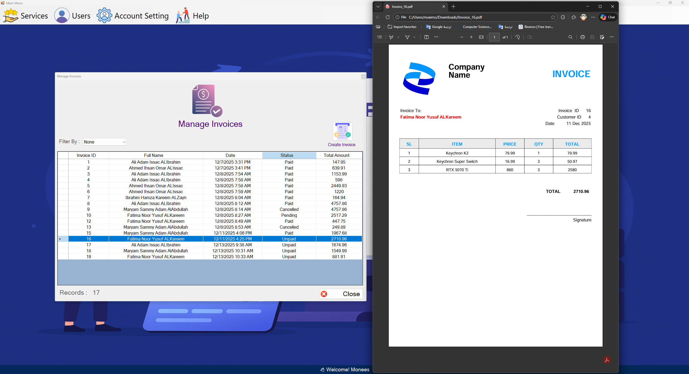
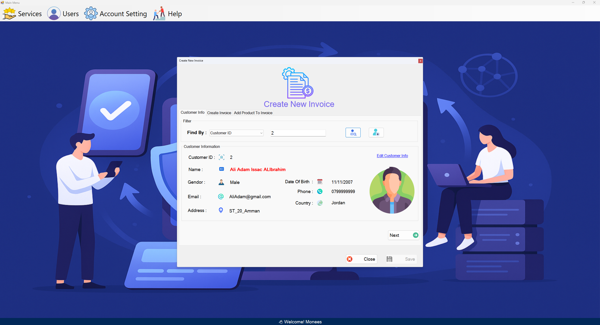
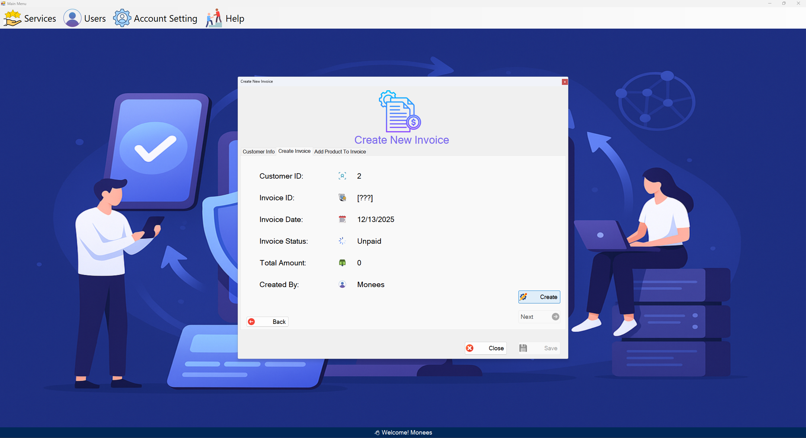
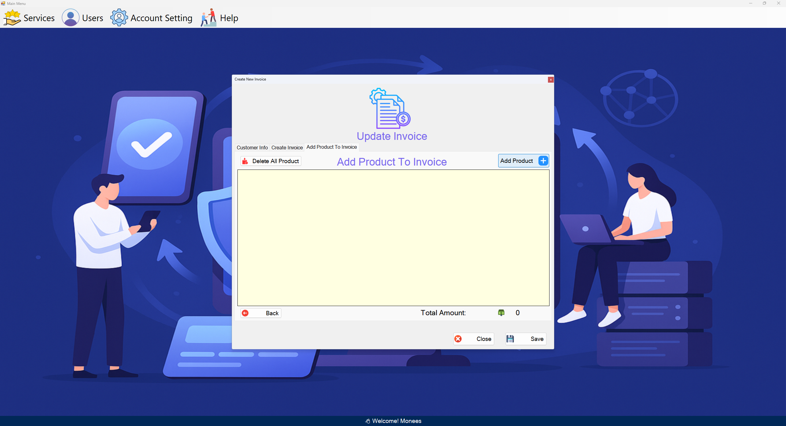
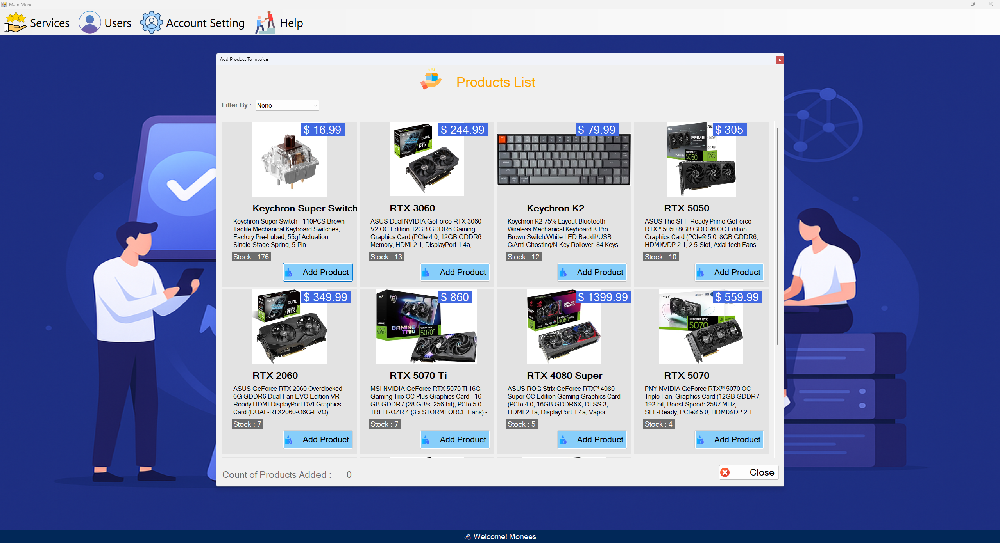
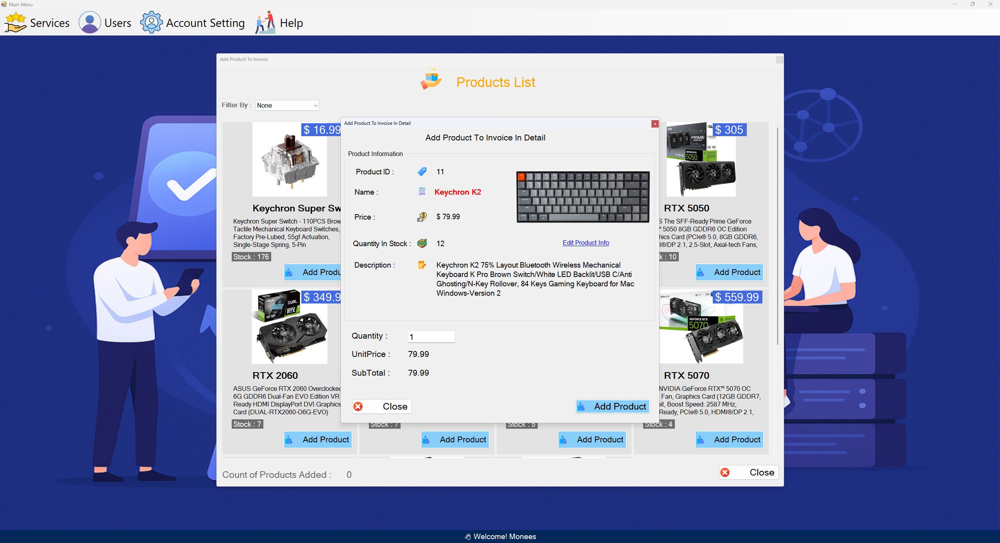
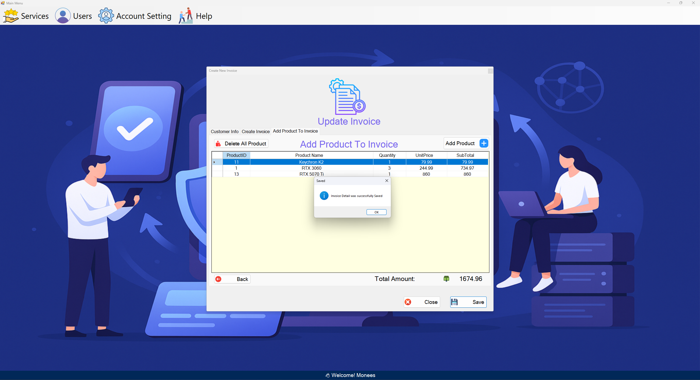

# Customer & Invoice Management System
A complete Customer & Invoice Management System built using C# WinForms, SQL Server, and ADO.NET.
The system implements full CRUD operations for customers, products, invoices, and payments.


This project is a customer and invoice management system designed as a professional transactional system.

Through it, you can register customers, register users (employees), register products, create invoices linked to existing customers in the system, and record payments linked to the invoice . All of this is saved in the database.

It was built for learning purposes and follows the **3-Tier Architecture** pattern: 

- **Presentation Layer** → Windows Forms (UI).  
- **Business Layer** → Business logic (rules, validations, workflows).  
- **Data Layer** → Database access (ADO.NET).

---

## 📌 Features
- Customer Management
- User Management (Employees)
- Product Management
- Invoice Creation & Management
- Payment Tracking
- Export Invoices as PDF
  
---
## Customers Screen


## PDF Template



## Invoice Creation Screen

<table>
  <tr>
    <td></td>
    <td></td>
    <td></td>
    <td></td>
    <td></td>
    <td></td>
  </tr>
</table>


---

## 🏷️ Main Services Provided

1. Customer Management
2. Invoice Management
3. Invoice Creation
4. Product Management
5. Payments
6. Reports


---

## 🔧 Technologies used:

 - C# (Windows Forms)

 - SQL Server & ADO.NET

 - 3-Tier Architecture (Presentation – Business – Data)
   
---

## 📚 Key learnings:

- Connecting the user interface to the database using a structured design.

- Implementing basic CRUD operations (Add – Update – Delete – Query) in an organized way.

- Improving code structure and understanding how to separate layers for easier maintenance and development.

---

## ▶️ How to Run

1. Clone the repository:
   ```bash
   git clone https://github.com/USERNAME/Customer-And-Invoice-Management-System.git

2. Restore the database:
    - Database name must be: CIMS

3. Open the solution:
    - Open CIMS.sln using Visual Studio

4. Run the project
   
    🔐 Default Login

      - Username: Monees

      - Password: 1234
  
---
## ⚠️ Note

```md
   > ⚠️ This project is built for learning and portfolio purposes.
